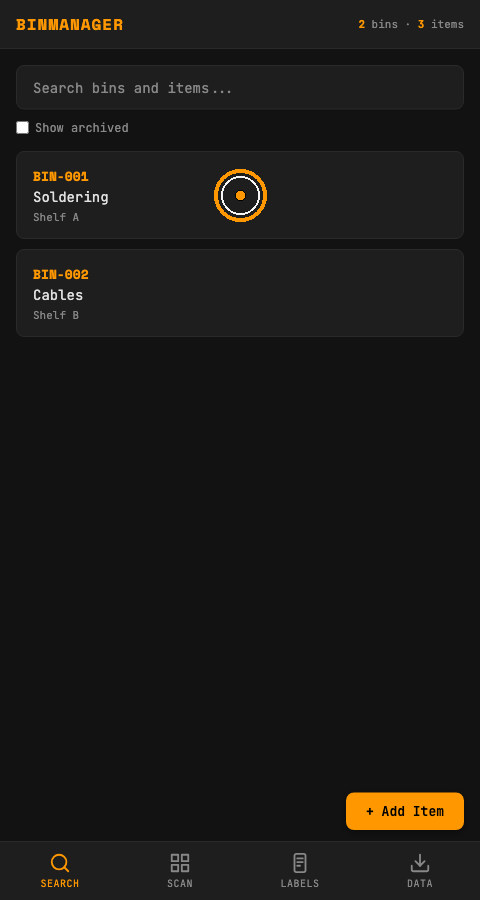
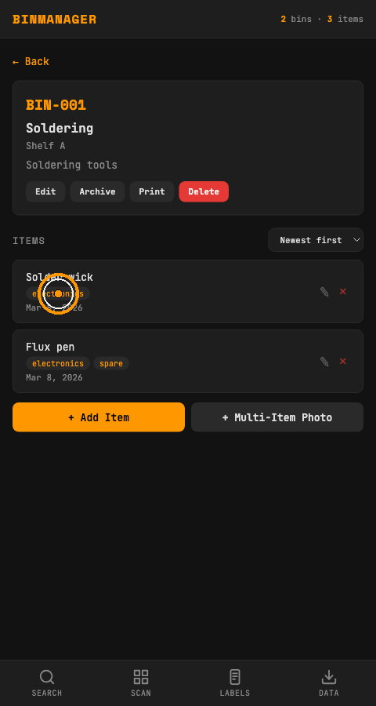
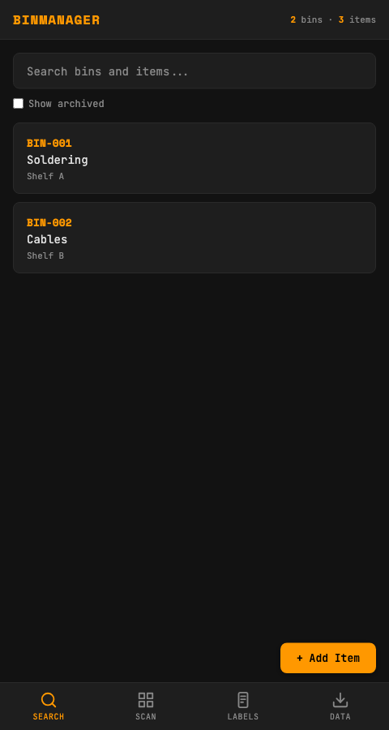
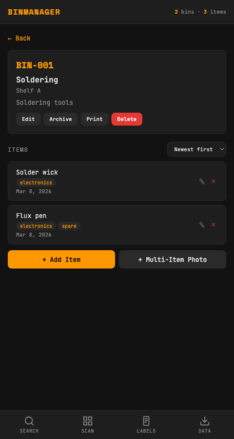
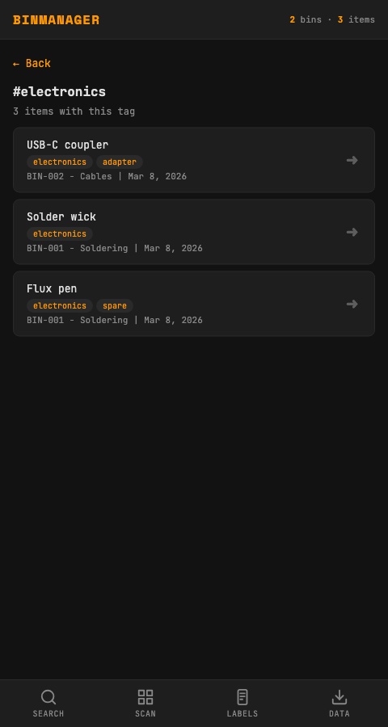

# Clickable Tags Feature Demo

This document demonstrates the new behavior where tapping a tag chip opens a dedicated view listing all items with that tag.

## GIF Walkthrough

### End-to-end flow (Search -> Bin -> Tag Results)

### Focused interaction (Bin -> Tag Results)

## Screenshots

### 1. Search view with demo bins

### 2. Bin detail with clickable tag chips

### 3. Tag results view showing matching items across bins

## What this verifies

- Tag chips are interactive controls in bin item cards.
- Clicking `electronics` opens a tag-centric results view.
- The results include matching items from multiple bins, not just the current bin.
- Users can navigate back from the tag results view.
