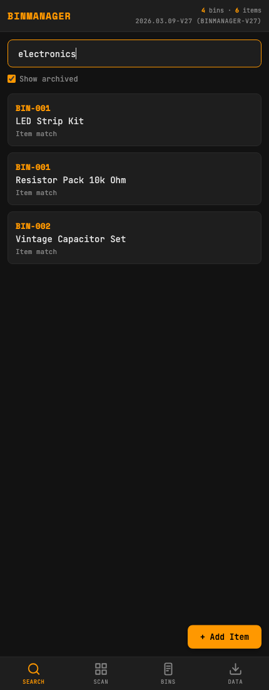
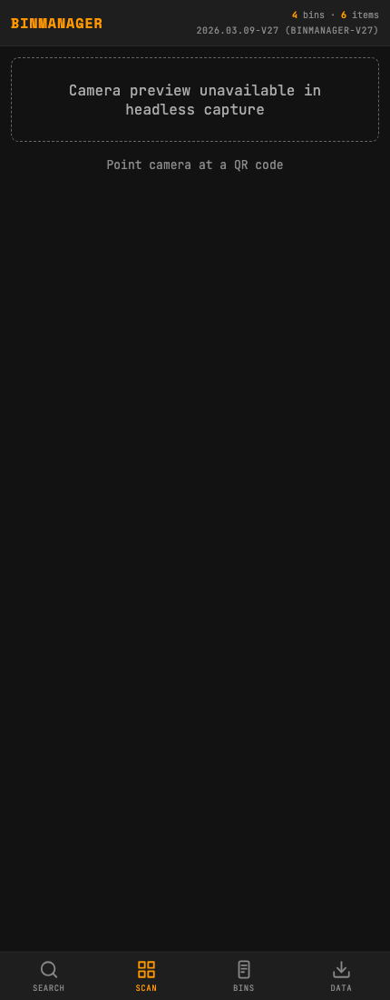
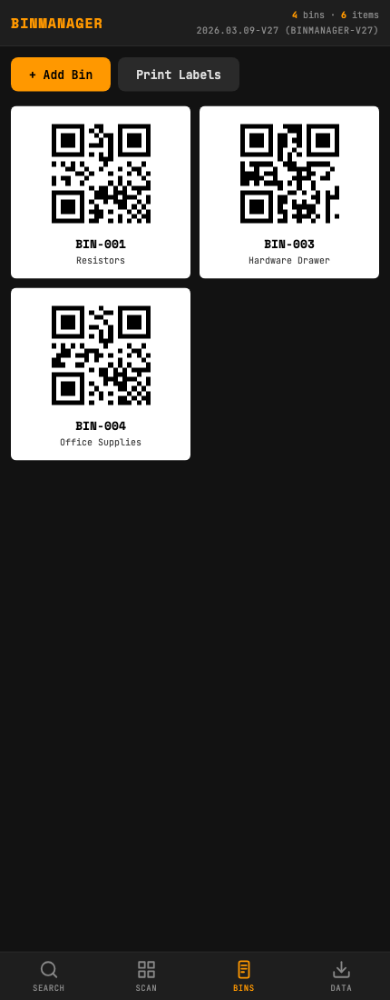
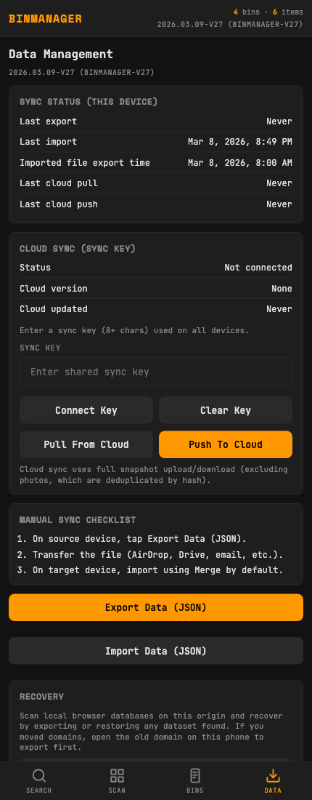
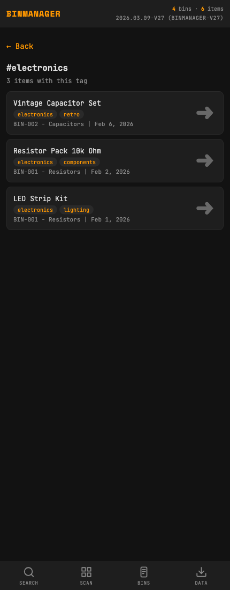
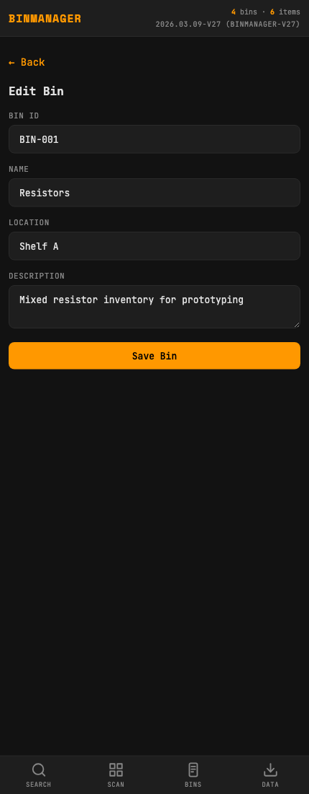
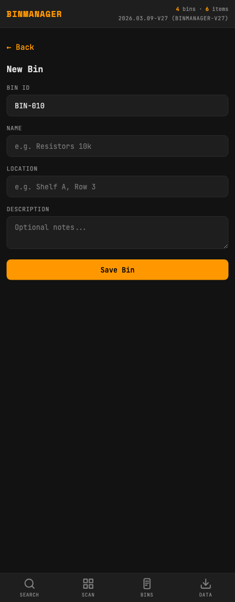
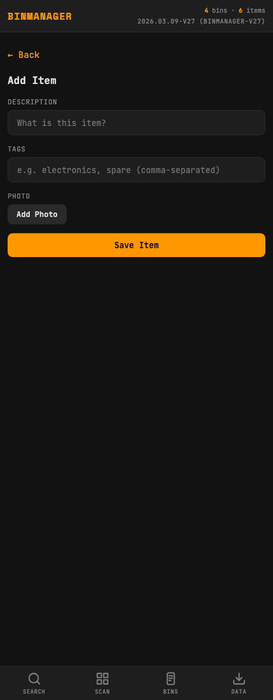
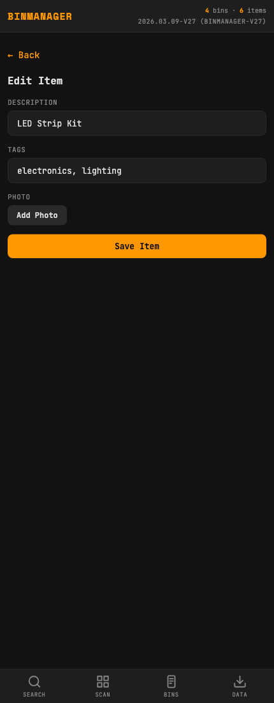
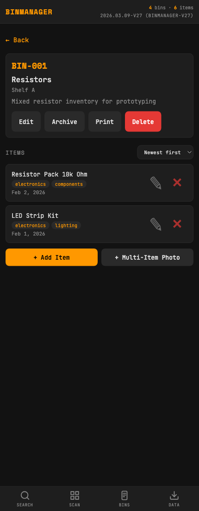

# BinManager Visual Record

Generated with `uvx rodney` automation after importing fixture data from `./fixtures/test-fixture-data.json`.

## Sitemap

- [Search View](#search-view) (`#search?q=electronics&archived=1`)
  - [Bin Detail View](#bin-detail-view) (`#bin/:binId`)
    - [Tag Results View](#tag-results-view) (`#tag/:tag`)
    - [Bin Form (Edit) View](#bin-form-edit-view) (`#bin-form/:binId?edit=1`)
    - [Item Form (Add) View](#item-form-add-view) (`#item-form?bin=:binId`)
    - [Item Form (Edit) View](#item-form-edit-view) (`#item-form/edit/:itemId`)
    - [Multi-Crop Route Behavior](#multi-crop-route-behavior) (`#multi-crop?bin=:binId`)
  - [Scan View](#scan-view) (`#scan`)
  - [Bins View](#bins-view) (`#bins`)
    - [Bin Form (New) View](#bin-form-new-view) (`#bin-form/:binId`)
  - [Data View](#data-view) (`#data`)

## Search View

- Route: `#search?q=electronics&archived=1`
- Fixture: `./fixtures/test-fixture-data.json`

## Scan View

- Route: `#scan`
- Fixture: `./fixtures/test-fixture-data.json`
- Note: Camera access in headless Rodney caused browser crashes. For this capture only, `Html5Qrcode` was runtime-mocked so the scan UI could be recorded.

## Bins View

- Route: `#bins`
- Fixture: `./fixtures/test-fixture-data.json`

## Data View

- Route: `#data`
- Fixture: `./fixtures/test-fixture-data.json`

## Bin Detail View

- Route: `#bin/BIN-001`
- Fixture: `./fixtures/test-fixture-data.json`

## Tag Results View

- Route: `#tag/electronics?origin=BIN-001`
- Fixture: `./fixtures/test-fixture-data.json`

## Bin Form (Edit) View

- Route: `#bin-form/BIN-001?edit=1`
- Fixture: `./fixtures/test-fixture-data.json`

## Bin Form (New) View

- Route: `#bin-form/BIN-010`
- Fixture: `./fixtures/test-fixture-data.json`

## Item Form (Add) View

- Route: `#item-form?bin=BIN-001`
- Fixture: `./fixtures/test-fixture-data.json`

## Item Form (Edit) View

- Route: `#item-form/edit/item-001`
- Fixture: `./fixtures/test-fixture-data.json`

## Multi-Crop Route Behavior

- Route tested: `#multi-crop?bin=BIN-001`
- Fixture: `./fixtures/test-fixture-data.json`
- Current behavior: this route resolves to `view-bin` in `applyRouteFromHash`, not `view-multi-crop`.

